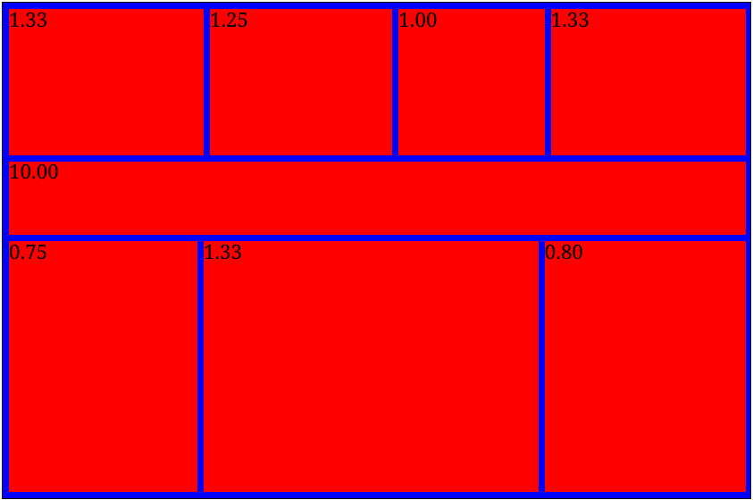

# Jigsaw

Jigsaw provides automatic image gallery layout in Javascript. You just
need to specify the aspect ratio of each image and the margin between
images, and it will do the rest.

For example, given eight images with aspect ratios 4:3, 5:4, 1:1, 4:3,
10:1, 4:3, 3:4, and 4:5, Jigsaw finds the following layout:

